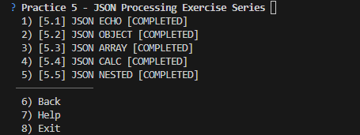

# Node.js JSON Processing Exercise Series

Практична робота № 5
Рішення практичних завдань в розділі Practice 5 - JSON Processing Exercise Series

## Список виконаних завдань:

1. JSON echo
2. JSON object
3. JSON array
4. JSON calc
5. JSON nested

## Як запустити:

Для запуску любого рішення треба використати команду:
'node <назва_файлу>.js <порт>'

Наприклад:
'node json_calc.js 3000'

## Результат:

